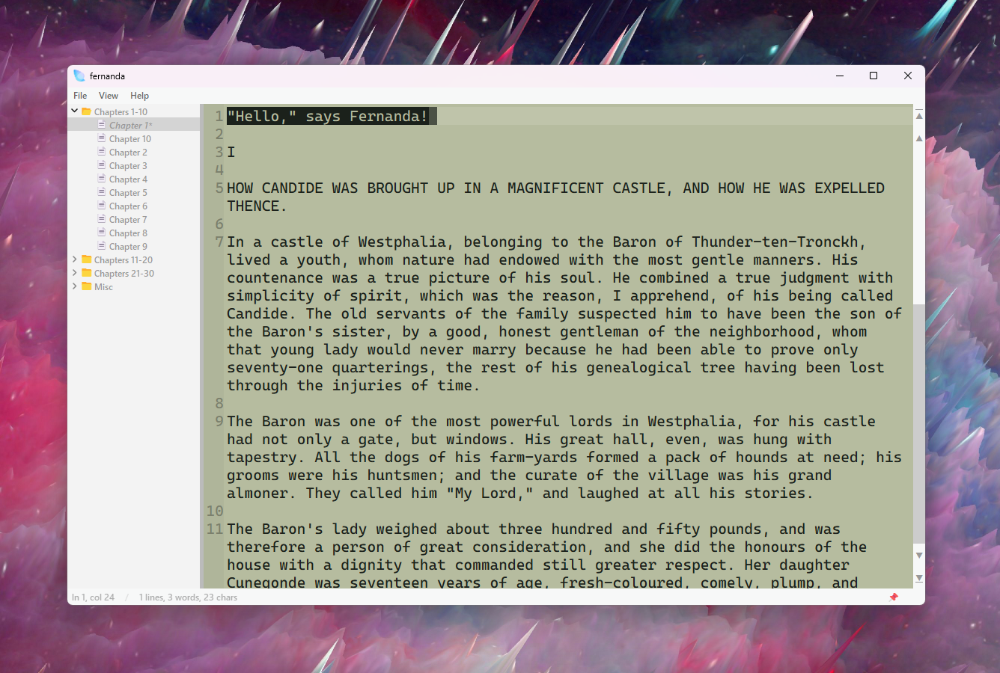
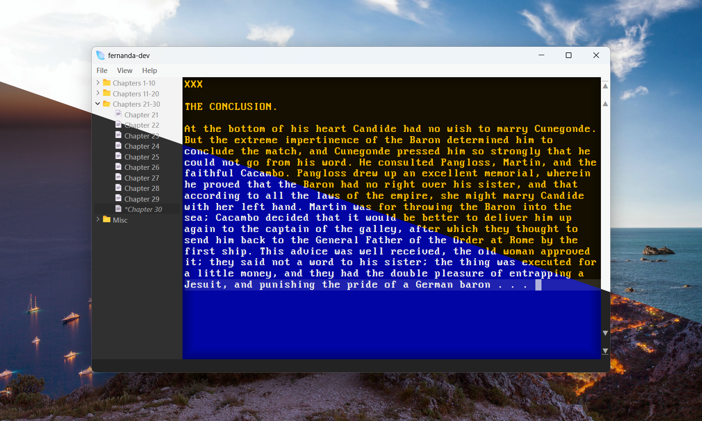
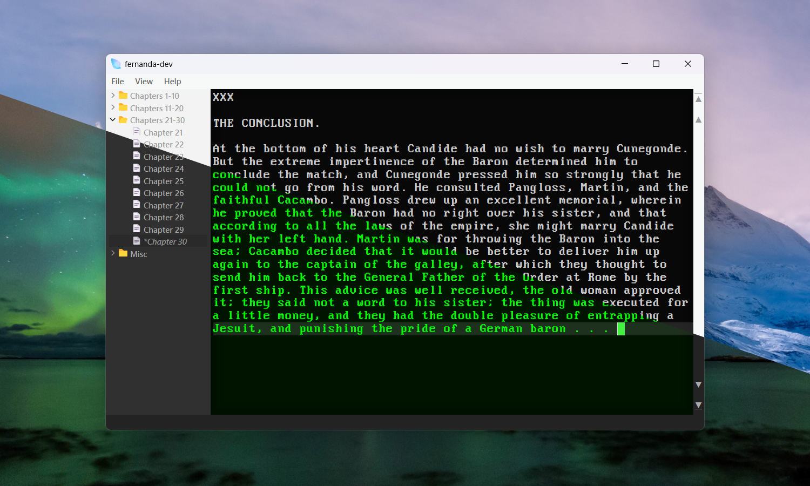

#  fernanda

	<kbd>
		
		 Fernanda running on Windows 11. (Wallpaper: "Red sky background" by <a href="https://www.deviantart.com/masterteacher/art/Red-sky-background-356199141">MasterTeacher</a>)
	</kbd>

	
	
	
	
	

## :tea: **hi**

Fernanda is a plain text editor for drafting long-form fiction. (At least, that's the plan.)

This is a personal project, a work-in-progress, and I am *so* not a programmer. Still, I decided I didn't like existing novel-writing software very much, and I wanted to make something all my own. My hope is that it's easy to use, lightly-customizable, and distraction-free, for faster, more peaceful drafting.

Fernanda's look was inspired by the good, quiet feeling of using [WordStar](https://en.wikipedia.org/wiki/WordStar) on [DOSBox](https://www.dosbox.com/) to draft, and its interface was inspired by [Atom](https://github.com/atom/atom) (goodnight :two_hearts:).

Fernanda got its name because I just really like the name a lot. But, as it turns out, Fernanda means an ["adventurous, bold journey"](https://en.wikipedia.org/wiki/Fernanda) (the kind one might be *called* to, say), and I think that's neat. 

## :compass: **roadmap**

- [Releases (Windows x64)](https://github.com/fairybow/fernanda/releases)

- [AUR](https://aur.archlinux.org/packages/fernanda)

An early Windows release is available for testing, and an early Arch Linux package is also available on the AUR (courtesy of [@philipplenk](https://github.com/philipplenk)).

Right now, I'm kind of going where the wind takes me. Fernanda is for drafting. Specifically, for me, it's for encouraging a more productive drafting headspace, and any features that seem like a must for making that happen easier, I'm going to try and add. Right now, in my mind, finished work can be revised in other programs. So, some things you might find in other binder-style writing programs aren't necessarily on the table for me right now (but also not necessarily out-of-the-question, either). I'm not interested in adding spellcheck, for example. I think for my purposes it would be distracting. Nor am I interested in any kind of highly-involved formatting or pre-publishing processes. I am, however, planning on adding a way to mark files for compilation for general export (one big file, or several if you want, where things more drafty than others, or notes, can be left out). Ways to view outlines or organize smaller notes or scraps (or even map them) is not necessarily out-of-the-question.

If I think of something big, I'll try to add it right here. Otherwise, these things, of varying importance or levels of commitment, will also appear in [todo.md](https://github.com/fairybow/fernanda/blob/main/fernanda/docs/todo.md).

- Persist undo/redo stacks between file changes
- Separators and possibly customizable file icons, for better mental organization at-a-glance
- Global word count
- Exporting (compiling, too, for export)
- Export to PDF (and possibly Word)

More to come.

## :honeybee: **built with**

Fernanda is built with:
- C++
- [Qt](https://www.qt.io/)
- and [Visual Studio Community](https://visualstudio.microsoft.com/vs/community/)

Fernanda's `.story` files rely on:
- Bit7z by [@rikyoz](https://github.com/rikyoz/bit7z)
- and, thus, 7-zip by [Igor Pavlov](https://www.7-zip.org/)

Among the fonts used are:

- Cascadia Mono by [@microsoft](https://github.com/microsoft/cascadia-code)
- Cozette :purple_heart: by [@slavfox](https://github.com/slavfox/Cozette)
- Day Roman by Apostrophic Labs
- Dot Matrix by [Dionaea Fonts](https://dionaea.com/information/fonts.php)
- Fixedsys Excelsior (with programming ligatures) by [@kika](https://github.com/kika/fixedsys)
- Iosevka by [@be5invis](https://github.com/be5invis/Iosevka)
- More Perfect DOS VGA by [@L∆MEUR](https://laemeur.sdf.org/fonts/)
- Nouveau IBM by Arto Hatanp‰‰
- and OpenDyslexic by [Abbie Gonzalez](https://opendyslexic.org/)

Fernanda's `.story` files are 7-zip (`.7z`, non-compressed) archives. They can be associated with Fernanda and then opened in the usual ways. However, they can also be opened with [7-zip](https://www.7-zip.org/), and the contents copied elsewhere. If you want to rename, move, or delete items within a `.story` project file, be sure to delete `story.xml` so that it can be recreated with the new paths. You will, however, lose any parentings that are at the same directory level (like a file parented by another file).

## :smiley_cat: **thanks**

A major thanks to [@philipplenk](https://codemetas.de/) for their teaching and interest and support in helping me work toward a small dream like this (and for helping me make Fernanda available for [Arch Linux](https://aur.archlinux.org/packages/fernanda)).

A major thanks, too, to [@rikyoz](https://github.com/rikyoz/) for their tireless work on the very amazing [bit7z library](https://github.com/rikyoz/bit7z).

## :heartpulse: **bye**

Older screens:

	<kbd>
		
		 Very early Fernanda running on Windows 11.
	</kbd>

	<kbd>
		
		 Slightly less early Fernanda running on Windows 11.
	</kbd>

	<kbd>
		
		 Dark window & blue editor / light window & amber editor.
	</kbd>

	<kbd>
		
		 Dark window & green editor / light window & grey editor.
	</kbd>

