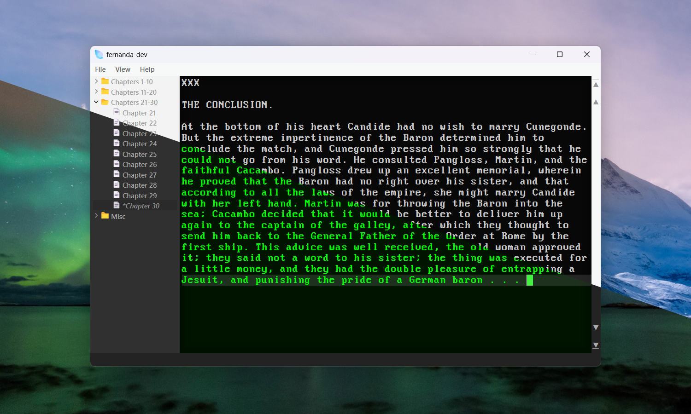

#  fernanda

	<kbd>
		
		 Very early Fernanda running on Windows 11.
	</kbd>

	
	
	
	

## :wave: **hi**

Fernanda is for drafting long-form fiction. (At least, that's the plan.)

This is a personal project, a work-in-progress, and I am *clearly* not a programmer. Still, I decided I didn't like existing novel-writing software very much, and so I decided to make something all my own. I wanted something that would be easy to use, lightly-customizable, and distraction-free, for faster, more peaceful drafting.

## :compass: **so, what's coming?**

A beta, by god. (What's here at the moment is *hella alpha*, and I don't recommend using it. Obviously.)

Here's what's happening ATM:

- Currently, I'm in the process of abstracting file-handling away from Fernanda's other classes.

- A global rewrite is also in-progress, as I continue to learn more about C++ (Number 3! :weary:)

- Custom ordering to, and pairing of, files within Fernanda.

- "Files" (kinda)
	- Currently, Fernanda works with regular directories. However, the plan is to implement self-contained "pseudo-files": single archives containing all your project's files. Much like Scrivener's `.scriv` folders, you'll find an XML file inside telling Fernanda how to render any special orderings or pairings of your project's files. Unlike a `.scriv` folder, however, your files will be in a human-navigable file tree (each file in the same subdirectory as it appears in your project in Fernanda).

## :honeybee:

Fernanda is built with C++, Qt, and Visual Studio.

## :seedling:

More to come.

	<kbd>
		
		 Slightly less early Fernanda running on Windows 11.
	</kbd>

	<kbd>
		
		 Dark window & blue editor / light window & amber editor.
	</kbd>

	<kbd>
		
		 Dark window & green editor / light window & grey editor.
	</kbd>

